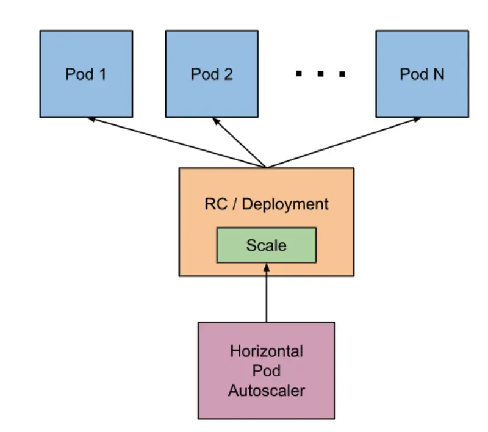

# Horizontal Pod Autoscaler


시작하기 전에 이 섹션을 위해 환경을 준비하세요:

```
~$ prepare-environment autoscaling/workloads/hpa
```

이는 다음과 같이 실습 환경을 변경할 것입니다:

* Amazon EKS 클러스터에 Kubernetes Metrics Server를 설치합니다.

여기에서 이러한 변경사항을 적용하는 Terraform을 볼 수 있습니다.



이 실습에서는 Horizontal Pod Autoscaler (HPA)를 살펴보며 deployment나 replica set의 Pod를 확장하는 방법을 알아볼 것입니다. HPA는 K8s API 리소스와 컨트롤러로 구현됩니다. 리소스는 컨트롤러의 동작을 결정합니다. Controller Manager는 각 HorizontalPodAutoscaler 정의에 지정된 메트릭에 대해 리소스 사용률을 쿼리합니다. 컨트롤러는 평균 CPU 사용률, 평균 메모리 사용률 또는 기타 사용자 지정 메트릭과 같은 메트릭을 관찰하여 사용자가 지정한 목표에 맞게 주기적으로 복제 컨트롤러 또는 deployment의 복제본 수를 조정합니다. 이는 리소스 메트릭 API(Pod별 리소스 메트릭의 경우) 또는 사용자 지정 메트릭 API(다른 모든 메트릭의 경우)에서 메트릭을 얻습니다.

Kubernetes Metrics Server는 클러스터의 리소스 사용 데이터를 확장 가능하고 효율적으로 집계하는 도구입니다. Horizontal Pod Autoscaler에 필요한 컨테이너 메트릭을 제공합니다. 메트릭 서버는 Amazon EKS 클러스터에 기본적으로 배포되지 않습니다.

<figure><figcaption></figcaption></figure>
