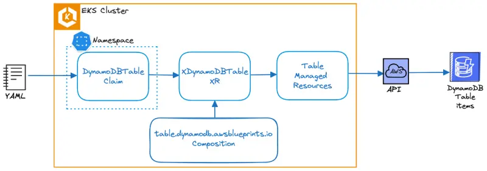

# Navigating the labs

이 웹사이트와 제공된 콘텐츠를 탐색하는 방법을 살펴보겠습니다.

## 구조&#x20;

이 워크숍의 콘텐츠는 다음으로 구성되어 있습니다:

1. 개별 실습 연습&#x20;
2. 실습과 관련된 개념을 설명하는 보조 콘텐츠

실습은 모든 모듈을 독립적인 연습으로 실행할 수 있도록 설계되었습니다. 실습 연습은 왼쪽 사이드바에 표시되며 여기에 보이는 아이콘으로 표시됩니다:

이 모듈에는 화면 왼쪽에 표시될 'Getting started'라는 단일 실습이 포함되어 있습니다.


각 실습은 이 배지로 표시된 페이지에서 시작해야 합니다. 실습 중간에서 시작하면 예측할 수 없는 동작이 발생할 수 있습니다.


브라우저에 따라 VSCode 터미널에 처음으로 복사/붙여넣기를 할 때 다음과 같은 프롬프트가 표시될 수 있습니다:

<figure><figcaption></figcaption></figure>

## EKS 클러스터 재설정&#x20;

실수로 클러스터를 제대로 작동하지 않는 방식으로 구성한 경우, EKS 클러스터를 최대한 재설정할 수 있는 메커니즘이 제공되었습니다. 언제든지 `prepare-environment` 명령어를 실행하고 완료될 때까지 기다리면 됩니다. 실행 시 클러스터 상태에 따라 몇 분이 소요될 수 있습니다.

