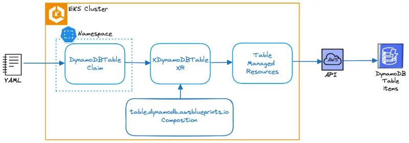

# AWS 이벤트 시

이 워크샵에 참여하면 실습 자료 완료를 위한 AWS 계정이 제공됩니다. [https://catalog.workshops.aws/](https://catalog.workshops.aws/) 에 접속하여 Get Started를 클릭하세요.

<figure><figcaption></figcaption></figure>

로그인 창이 나타나면 Email One-Time Password(OTP) 옵션을 선택하세요.

<figure><figcaption></figcaption></figure>

이메일 주소를 입력하고 Send passcode를 누르면 일회용 패스코드가 이메일로 전송됩니다. 이메일을 받으면 패스코드를 입력하고 로그인하세요.

실습 시작 전 강사가 이벤트 액세스 코드를 제공했을 것입니다. 제공받은 해시 코드를 텍스트 박스에 입력하고 Next를 클릭하세요.

<figure><figcaption></figcaption></figure>

이용 약관을 읽고 동의한 후 Join event를 클릭하여 계속하세요.

<figure><figcaption></figcaption></figure>

개인 대시보드가 표시됩니다. Open AWS Console 버튼을 선택하면 AWS 계정 콘솔로 이동합니다:

<figure><figcaption></figcaption></figure>

다시 개인 대시보드 페이지로 돌아가 Event Outputs 섹션으로 스크롤하세요. IdeUrl 필드의 URL을 복사해 새 브라우저 탭에서 여세요:

<figure><figcaption></figcaption></figure>

비밀번호를 입력하라는 메시지가 표시됩니다:

<figure><figcaption></figcaption></figure>

출력에서 IdePassword 값을 입력하면 IDE가 로드됩니다.

<figure><figcaption></figcaption></figure>

Get started를 눌러 워크샵 시작 페이지에 접속하세요:

<figure><figcaption></figcaption></figure>

이제 실습 탐색 섹션으로 진행할 수 있습니다.
